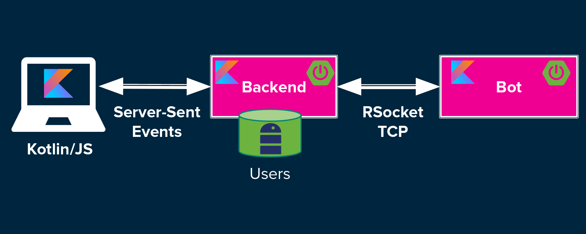

== Step by step Spring Boot + Kotlin + Coroutines application

This is the repository containing the code of my Devoxx 2019 deepdive in into Reactive Spring with Coroutines and Kotlin Flow.

It contains the code of a simple distributed messenger application built step by step (one step per GIT branch):

 * https://github.com/sdeleuze/spring-messenger/tree/step-1-webflux-r2dbc[step-1-webflux-r2dbc]: Spring WebFlux with `@Controller` and https://r2dbc.io/[R2DBC]
 * https://github.com/sdeleuze/spring-messenger/tree/step-2-webflux-functional[step-2-webflux-functional]: Router DSL and functional APIs
 * https://github.com/sdeleuze/spring-messenger/tree/step-3-rsocket[step-3-rsocket]: http://rsocket.io/[RSocket]
 * https://github.com/sdeleuze/spring-messenger/tree/step-4-kotlin-js[step-4-kotlin-js]: Kotlin/JS
 * https://github.com/sdeleuze/spring-messenger/tree/step-5-kofu[step-5-kofu]: https://github.com/spring-projects-experimental/spring-fu[Kofu DSL]

Notice that it could be updated to use RSocket for Frontend/Backend communication by leveraging https://github.com/rsocket/rsocket-js[rsocket-js] but this requires creating the Kotlin/JS API wrapper.

Another ambitious but exciting improvement would be to have a RSocket multiplatform library exposed as an API with suspending functions and Kotlin `Flow`, see https://github.com/rsocket/rsocket-kotlin/issues/59[rsocket-kotlin#59] for more details.